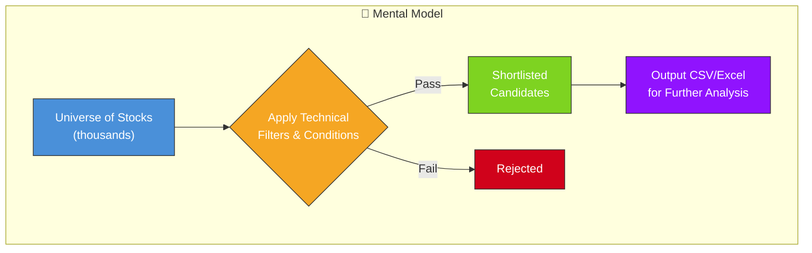
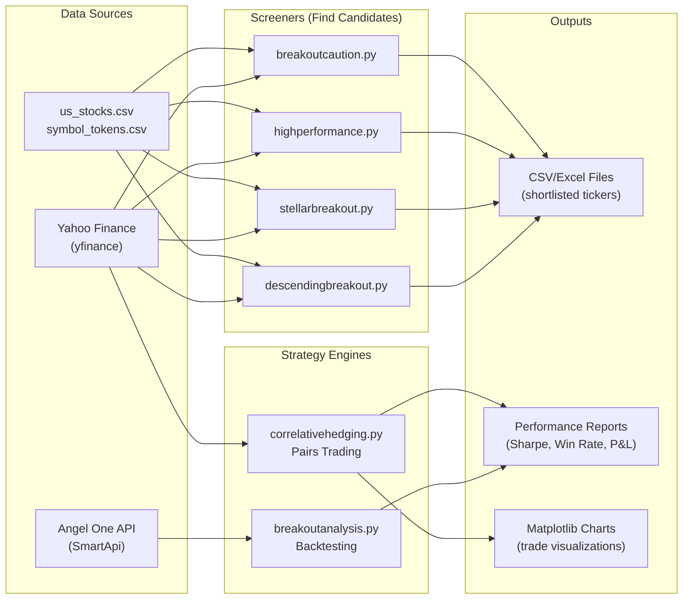
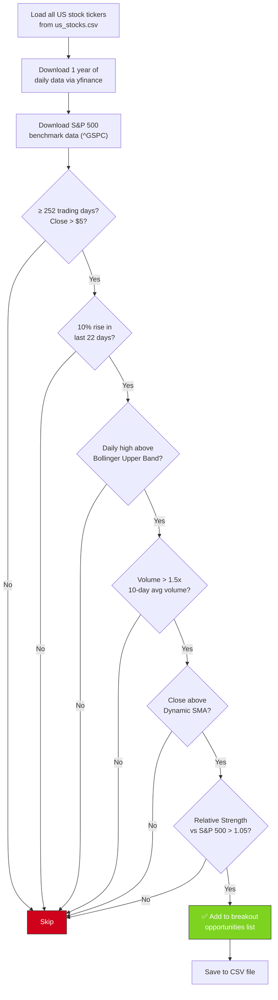
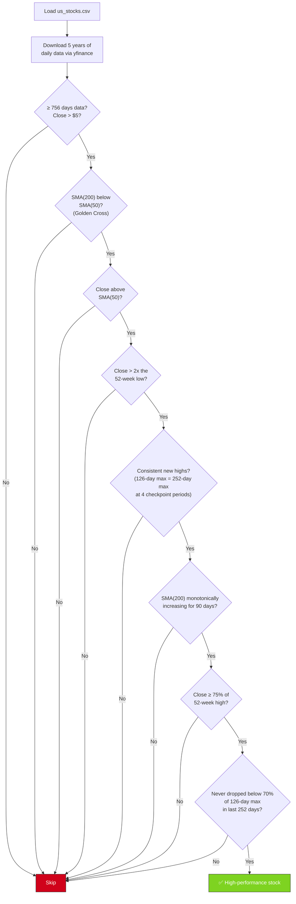
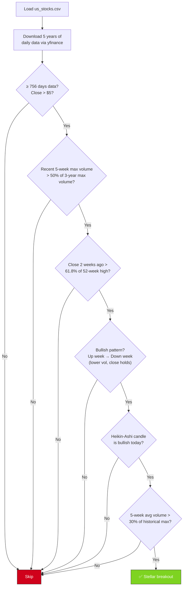
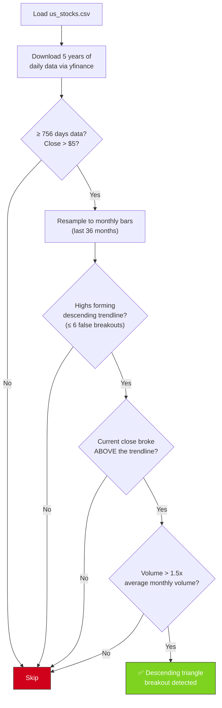
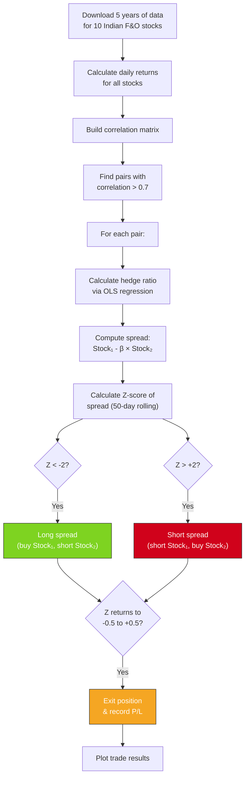
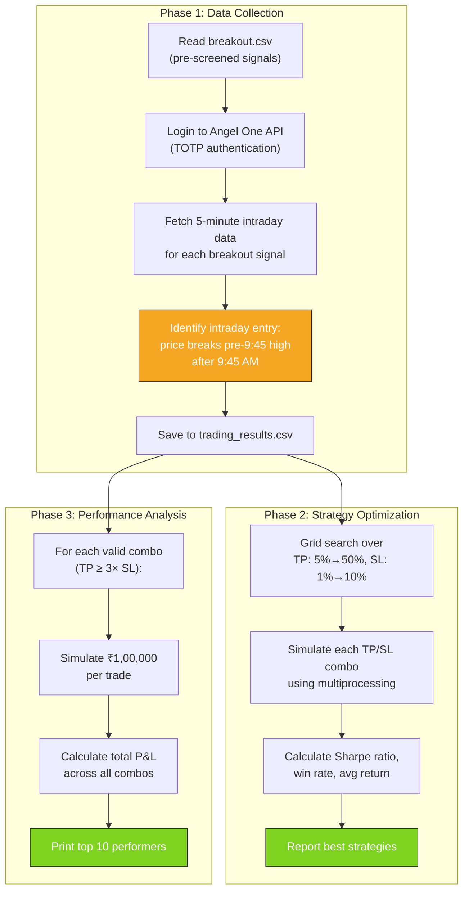
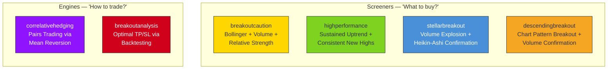
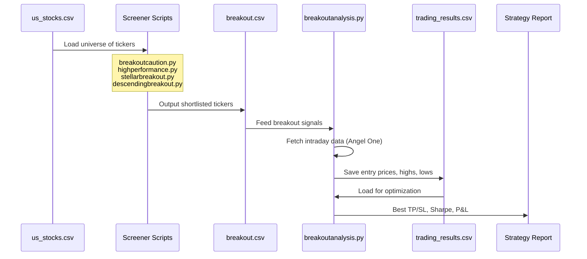

# 📊 Stock Analysis Repository — Complete Documentation

## Mental Model: What is this repo?

Think of this repo as a **toolbox of stock screeners and trading strategy analyzers**. Each Python script is a standalone tool that:

1. **Reads a universe of stocks** (from a CSV file or API)
2. **Applies a set of technical filters/conditions** (moving averages, volume spikes, chart patterns, etc.)
3. **Outputs a shortlist** of stocks that pass all filters — these are your "candidates" for further analysis or trading

The key idea: **each script embodies a different trading philosophy**, from momentum breakouts to statistical pairs trading.



---

## Repository Structure

| File | Purpose | Market | Data Source |
|---|---|---|---|
| [breakoutcaution.py](file:///Users/rohit/Workspace/rohit/Stock/breakoutcaution.py) | **Bollinger Band + Volume breakout screener** | 🇺🇸 US Stocks | Yahoo Finance |
| [highperformance.py](file:///Users/rohit/Workspace/rohit/Stock/highperformance.py) | **Sustained uptrend / high-momentum screener** | 🇺🇸 US Stocks | Yahoo Finance |
| [stellarbreakout.py](file:///Users/rohit/Workspace/rohit/Stock/stellarbreakout.py) | **Volume-confirmed breakout + Heikin-Ashi screener** | 🇺🇸 US Stocks | Yahoo Finance |
| [descendingbreakout.py](file:///Users/rohit/Workspace/rohit/Stock/descendingbreakout.py) | **Descending triangle breakout screener** | 🇺🇸 US Stocks | Yahoo Finance |
| [correlativehedging.py](file:///Users/rohit/Workspace/rohit/Stock/correlativehedging.py) | **Pairs trading simulator** (mean-reversion) | 🇮🇳 Indian F&O | Yahoo Finance |
| [breakoutanalysis.py](file:///Users/rohit/Workspace/rohit/Stock/breakoutanalysis.py) | **Backtesting engine** for breakout strategies | 🇮🇳 Indian NSE | Angel One API |

---

## High-Level Architecture



---

## Detailed Script Breakdowns

---

### 1. 🟡 breakoutcaution.py — Bollinger Band Breakout Screener

**Philosophy**: Find stocks that are breaking above their Bollinger Band with volume confirmation and relative strength against the S&P 500. This catches momentum breakouts that are supported by institutional participation.

**How it works step-by-step:**



**Technical indicators used:**

| Indicator | How It's Calculated | What It Means |
|---|---|---|
| **Bollinger Upper Band** | 20-day SMA + 2 × 20-day StdDev | Price breaking above this = unusual strength |
| **Volume Confirmation** | Current volume vs 10-day avg × 1.5 | Big players are participating in the move |
| **Dynamic SMA** | 10-day SMA + 0.5 × ATR(14) | A volatility-adjusted trend filter |
| **ATR (Average True Range)** | 14-day average of max(H-L, H-prevC, L-prevC) | Measures volatility |
| **Relative Strength** | Stock returns / S&P 500 returns (20-day rolling) | Is this stock outperforming the market? |
| **Monthly Momentum** | (Close - Close_22days_ago) / Close_22days_ago | Must be > 10% |

**Input**: [us_stocks.csv](file:///Users/rohit/Workspace/rohit/Stock/us_stocks.csv), a backtest date (user-provided)
**Output**: `us_breakout_opportunities_{date}.csv`

---

### 2. 🟢 highperformance.py — Sustained Uptrend Screener

**Philosophy**: Find stocks in a **sustained, powerful uptrend** — not just a momentary spike. It looks for stocks that have been consistently making new highs for over a year, with the long-term trend firmly pointing upward.

**How it works:**



**What makes this screener special**:

The [check_consistent_max_close](file:///Users/rohit/Workspace/rohit/Stock/highperformance.py#40-69) function is the most unique filter — it checks that **at 4 different time checkpoints** (now, 6 months ago, 12 months ago, 18 months ago), the 6-month max equals the 12-month max. This means the stock has been making new 12-month highs every 6 months for the last 1.5 years — a sign of **relentless, institutional-quality uptrend**.

| Filter | Purpose |
|---|---|
| Golden Cross (50 > 200 SMA) | Long-term uptrend confirmed |
| Close > 2× 52-week low | Has doubled from its bottom |
| Consistent max close at 4 checkpoints | Relentless new-high-making behavior |
| SMA(200) monotonically increasing 90d | Even the slowest trend indicator is rising every day |
| Never below 70% of 126-day max | No significant drawdowns in the past year |

**Output**: `highperformance-{timestamp}.csv`

---

### 3. 🔵 stellarbreakout.py — Volume + Heikin-Ashi Breakout Screener

**Philosophy**: Find stocks showing a **volume explosion** combined with a classic **bullish consolidation pattern** (up week → down week on lower volume → close holds above the up week's open) and confirm bullishness with Heikin-Ashi candles.



**Key concepts explained:**

- **Heikin-Ashi candles**: A smoothed version of regular candlesticks. HA Close = avg(O,H,L,C), HA Open = avg(prev_O, prev_C). When HA Close ≥ HA Open → bullish sentiment is confirmed.
- **61.8% Fibonacci level**: If the close 2 weeks ago was above 61.8% of the 52-week high, the stock hasn't fallen too far from its peak — it's consolidating, not collapsing.
- **Volume explosion check**: If recent volume is surging relative to historical volume, big money is moving into the stock.
- **Consolidation pattern** (the [check_conditions](file:///Users/rohit/Workspace/rohit/Stock/stellarbreakout.py#44-67) function): Looks for an **up week followed by a down week with lower volume and a held close** — this is a textbook "bull flag" or "healthy pullback" pattern.

**Output**: `stellarbreakout-{timestamp}.csv`

---

### 4. 🟠 descendingbreakout.py — Descending Triangle Breakout Screener

**Philosophy**: A **descending triangle** is a chart pattern where highs keep getting lower (forming a downward trendline) while lows stay roughly flat. When the price breaks **above** this descending trendline with volume, it's a bullish breakout.



**How the trendline is calculated:**

```
Month 1 High: $50  ← Peak (start of trendline)
Month 2 High: $48  ← Lower high ✓
Month 3 High: $52  ← False breakout (tolerance allows up to 6)
Month 4 High: $46  ← Lower high ✓
...
Trendline slope = (last_high - first_high) / (N - 1)
If current close > projected trendline value → BREAKOUT!
```

**Output**: `monthly_descending_triangle_breakouts_{months}m_{timestamp}.xlsx`

---

### 5. 🟣 correlativehedging.py — Pairs Trading Simulator

**Philosophy**: This is fundamentally different from the screeners above. Instead of finding individual breakout stocks, it uses **statistical arbitrage (pairs trading)** — finding two highly correlated stocks and betting on their price ratio reverting to the mean.



**Key concepts:**

| Concept | Explanation |
|---|---|
| **Correlation matrix** | Measures how closely two stocks move together (0 = no relation, 1 = perfect correlation) |
| **Hedge ratio (β)** | If β=0.8, for every ₹1 of Stock₁ you hold, you hedge with ₹0.80 of Stock₂ |
| **Spread** | `Price₁ - β × Price₂`. When correlated stocks diverge, this spread widens |
| **Z-score** | How many standard deviations the spread is from its mean. Z > 2 or Z < -2 = unusual divergence |
| **Mean reversion** | The bet: if two correlated stocks diverge, they'll converge back. Profit when they do |

**Why the ₹ symbol?** This script targets **Indian F&O (Futures & Options) stocks** on the NSE (e.g., RELIANCE.NS, TCS.NS).

**Output**: Console output with trade details + Matplotlib charts showing trade entry/exit points.

---

### 6. 🔴 breakoutanalysis.py — Backtesting Engine

**Philosophy**: Unlike the screeners, this script **backtests** a breakout strategy to find the **optimal take-profit and stop-loss levels**. It answers: *"If I had traded every breakout signal, what TP/SL combination would have made the most money?"*



**What makes this script unique:**

1. **Angel One API integration** — Uses SmartConnect with TOTP-based 2FA authentication to fetch real intraday data (5-minute candles)
2. **Rate limiting** — Built-in [RateLimiter](file:///Users/rohit/Workspace/rohit/Stock/breakoutanalysis.py#32-42) class with multiprocessing-safe locking to respect API limits
3. **Intraday entry logic** — Doesn't just buy at the open. It waits until 9:45 AM, calculates the pre-market high, and enters only when the price breaks above it
4. **Weekly deduplication** — Only processes one breakout per stock per week to avoid overtrading
5. **Parallel optimization** — Uses Python's `multiprocessing.Pool` to parallelize strategy evaluation across CPU cores

**The optimization constraint**: Only tests TP/SL combos where TP ≥ 3× SL (e.g., TP=15%, SL=5%) — this enforces a minimum reward-to-risk ratio.

**Output**: Console reports showing best Sharpe ratio strategy, most profitable strategy, and top 10 TP/SL combinations by return.

---

## Strategy Comparison



|  | breakoutcaution | highperformance | stellarbreakout | descendingbreakout | correlativehedging | breakoutanalysis |
|---|---|---|---|---|---|---|
| **Type** | Screener | Screener | Screener | Screener | Strategy Sim | Backtester |
| **Market** | US | US | US | US | India (F&O) | India (NSE) |
| **Timeframe** | Daily | Daily | Daily + Weekly | Monthly | Daily | 5-min intraday |
| **Data Source** | yfinance | yfinance | yfinance | yfinance | yfinance | Angel One API |
| **Core Idea** | Bollinger breakout | Relentless uptrend | Volume + HA confirmation | Chart pattern breakout | Mean reversion | Optimal TP/SL |
| **Output** | Ticker list (CSV) | Ticker list (CSV) | Ticker list (CSV) | Ticker list (Excel) | Trades + P/L | Strategy report |

---

## Data Flow: End-to-End Pipeline

Here's how these scripts might be used together as a **complete trading workflow**:



---

## Key Technical Indicators Glossary

| Indicator | Used In | Quick Explanation |
|---|---|---|
| **SMA (Simple Moving Average)** | breakoutcaution, highperformance | Average of last N closing prices |
| **Bollinger Bands** | breakoutcaution | SMA ± 2 standard deviations. Breakout above = unusual strength |
| **ATR (Average True Range)** | breakoutcaution | Average daily price range — measures volatility |
| **Relative Strength** | breakoutcaution | Stock return ÷ benchmark return. > 1 = outperforming |
| **Golden Cross** | highperformance | 50-day SMA crosses above 200-day SMA — classic bullish signal |
| **Heikin-Ashi** | stellarbreakout | Smoothed candles that filter noise — HA Close ≥ HA Open = bullish |
| **Descending Triangle** | descendingbreakout | Chart pattern: lower highs + flat lows → breakout above = bullish |
| **Z-score** | correlativehedging | Standard deviations from mean — used to detect price anomalies |
| **Hedge Ratio (β)** | correlativehedging | OLS regression coefficient determining position sizing |
| **Sharpe Ratio** | breakoutanalysis | Risk-adjusted return: mean(return) / std(return) |

---

## Dependencies

| Package | Purpose | Scripts |
|---|---|---|
| `yfinance` | Download stock data from Yahoo Finance | All except breakoutanalysis |
| `pandas` + `numpy` | Data manipulation and numerical computation | All |
| `matplotlib` + `seaborn` | Charting and visualization | correlativehedging, breakoutanalysis |
| `scipy` + `sklearn` | Statistics and regression | correlativehedging |
| `SmartApi` | Angel One brokerage API | breakoutanalysis |
| `pyotp` | TOTP-based two-factor authentication | breakoutanalysis |
| `ratelimit` | API rate limiting | breakoutanalysis |
| `tqdm` | Progress bars | breakoutanalysis |

---

## CSV Files (Reference Only)

| File | Contents |
|---|---|
| [us_stocks.csv](file:///Users/rohit/Workspace/rohit/Stock/us_stocks.csv) | List of US stock tickers (Symbol column) — the "universe" for US screeners |
| [symbol_tokens.csv](file:///Users/rohit/Workspace/rohit/Stock/symbol_tokens.csv) | Cached mapping of NSE stock symbols → Angel One API tokens |
